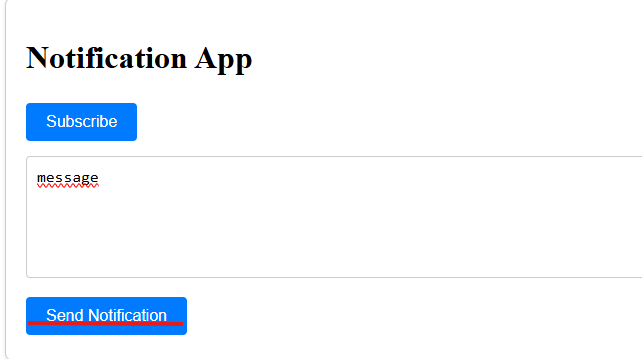

# trabalho-sd

## 1. Para implementar
O projeto foi implementado com base em um back-end monolítico, um back-end baseado em microsserviços e o front-end (interface do usuário). O back-end monolítico e os microsserviços foram implementados utilizando Node.js, enquanto o 
front-end utiliza Angular. 

### 1.1. Front-end: Angular + Firebase Service Worker 
O frontend é desenvolvido com Angular e se comunica com os microserviços através de requisições HTTP. Ele também utiliza Firebase para gerenciar as notificações push.Passos para Implementar: 
1. Configuração do Projeto Angular: 
- Inicie um novo projeto Angular com o comando: ng new front-end 
- Instale as dependências do Firebase e Angular Fire: npm install firebase @angular/fire 
2. Configuração do firebase: 
- A chave do Firebase e outras configurações de inicialização são armazenadas no arquivo src/app/services/firebase.service.ts. 3 
- Para registrar o service worker e configurar as notificações, use firebase.messaging como feito no arquivo public/serviceWorker.js. 
3. Registro de Service Worker: 
- Em app.component.ts, o frontend solicita permissão para receber notificações e registra o service worker. Ele também assina o usuário para as notificações push, utilizando a chave pública VAPID obtida do microserviço de notificações. 
4. Enviar Notificações: 
- O frontend permite ao usuário enviar notificações, que são tratadas no método sendNotification(), realizando uma requisição POST para o microserviço de notificações.

### 1.2.  Back-end (Microserviços)
O back-end é composto por dois microserviços: notification-service e subscription-service, cada um responsável por uma função específica. 

1. Criando os Microserviços: 
- Inicie cada microserviço dentro da pasta microservice_backend/api/ com TypeScript. Cada serviço é estruturado com um arquivo index.ts para gerenciar a lógica de negócio. 
2. Notification Service: 
- O serviço de notificações é responsável por enviar as mensagens push aos usuários. Ele utiliza o web-push para enviar as notificações. 4 
- Este serviço também lida com a chave pública VAPID, que o front-end utiliza para se inscrever nas notificações. 
3. Subscription Service: 
- O serviço de assinaturas armazena as assinaturas dos usuários, permitindo adicionar, remover e listar as assinaturas. 
- Ele usa requisições HTTP para manipular as assinaturas, recebendo e enviando dados em formato JSON.

### 1.3. Monolito: Back-end Centralizado
O monolito (localizado em monolith_backend/) é uma versão simplificada de todo o 
back-end em um único serviço.

1. Inicializando o Monolito: 
- O monolito também utiliza web-push para gerenciar as notificações. Porém, ao contrário dos microserviços, ele centraliza todas as funções em um único arquivo, com rotas para adicionar assinaturas, enviar notificações e retornar a chave VAPID. 
- As notificações podem ser enviadas através do endpoint /notify, e as assinaturas podem ser gerenciadas através do endpoint /subscribe. 
2. Firebase e Service Worker: 
- O monolito também lida com a configuração do Firebase e a manipulação das notificações push, como no microserviço de notificações.

### 1.4. Deploy: Vercel + Firebase
O deploy do projeto é feito em duas plataformas: Vercel para o front-end e Firebase 
para os microserviços.

1. Configuração do Firebase: 
- Os microserviços são configurados para serem executados no Firebase Functions, com o código de cada serviço sendo definido dentro das pastas notification-service e subscription-service. 
- O arquivo firebase.json especifica quais serviços devem ser deployados e as configurações de pré-deploy. 
2. Configuração do Vercel: 
- O arquivo vercel.json define como o projeto deve ser buildado e serve para configurar o deploy das funções (back-end) e do front-end na Vercel. 
- A pasta frontend é configurada para ser deployada com a opção @vercel/static-build, enquanto os microserviços são deployados utilizando a opção @vercel/node.

## 2. Para o uso
O sistema é um serviço de envio e recebimento de notificações distribuídas, utilizando o Firebase da Google para gerenciar os tópicos de mensagens e dispositivos inscritos. A comunicação é baseada em notificações enviadas a dispositivos conectados e inscritos no sistema. 

Para acessar a aplicação basta entrar no site:
    ```https://trabalho-sd.vercel.app/frontend/index.html```

1. Após entrar no site, esta será a telá inicial

2. Para permitir o recebimento de mensagens, clique no botao azul escrito "Subscribe"

3. Logo após, o navegador pedirá permissão de envio de notificação, que deverá ser aceita para o uso do sistema


A partir deste momento, todas as notificações serão recebidas, como no exemplo:


Para enviar notificações basta digitar a mensagem no campo de texto e clicar no botão escrito "Send NOtification":

